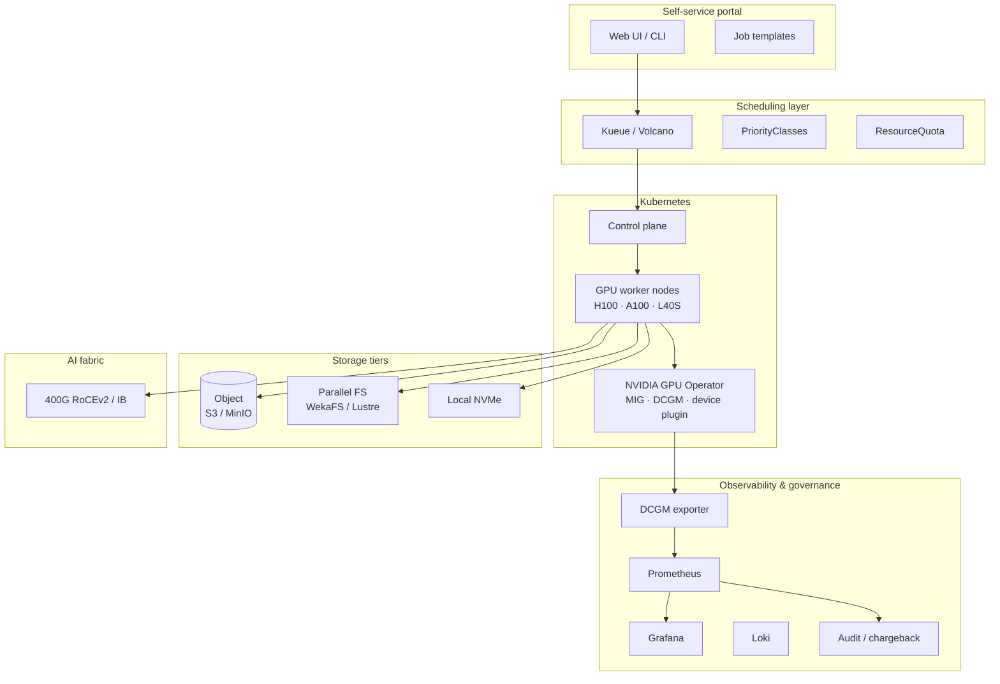

# AI Platform on Kubernetes — Reference Architecture

**Author:** Mohammed Abood
**Version:** 1.0
**Status:** Reference / illustrative

---

## 1. Context

An organisation wants to consolidate ad-hoc GPU workstations and one-off VM-based experiments into a **shared, multi-tenant GPU platform** running on Kubernetes — supporting both research (training, fine-tuning) and production (inference, RAG) workloads.

## 2. Goals

- **Self-service** — data scientists submit jobs without raising tickets
- **Shared utilisation** — high GPU utilisation across tenants
- **Multi-tenancy** — strong isolation between teams (quota, network, secrets, data)
- **Cost visibility** — who used how many GPU-hours
- **Production-grade** — same platform serves inference SLAs

## 3. Stack overview

## 4. Design decisions

### 4.1 Cluster topology
- Single Kubernetes cluster per environment (dev / prod)
- GPU nodes labelled & tainted; non-GPU workloads excluded
- Topology-aware scheduling: GPU nodes grouped by rack / NVLink island
- Control-plane on non-GPU nodes; physically separate from worker fleet

### 4.2 GPU management
- NVIDIA GPU Operator manages drivers, container toolkit, MIG, DCGM, GPU feature discovery
- **MIG strategy** = `mixed` so the same physical GPU exposes whole-GPU + MIG slices
- Profiles defined at boot via node config; not changed dynamically per pod

### 4.3 Scheduling
- **Kueue** for gang-scheduling and queue-based admission
- **Three priority tiers** — production inference > training > batch experimentation
- Batch jobs are preemptible by higher-tier workloads
- Topology-aware placement avoids scattering all-reduce jobs across NVLink islands

### 4.4 Tenancy model

| Concern | Mechanism |
|---|---|
| CPU/Memory/GPU caps | `ResourceQuota` per namespace |
| Network isolation | `NetworkPolicy` per namespace; default-deny |
| Data isolation | Per-namespace S3 bucket prefix + IAM; per-namespace parallel-FS subtree |
| Secrets | External Secrets Operator → Vault; no plaintext in manifests |
| Identity | Workload Identity (OIDC) per namespace |

### 4.5 Storage
- **Hot scratch** — local NVMe per GPU node (`emptyDir` or local-volume PV)
- **Warm** — parallel FS (WekaFS / Lustre) mounted across cluster
- **Cold** — S3-compatible object store; primary location for checkpoints and datasets at rest
- **Pre-fetching** — sidecar or init-container hydrates dataset to NVMe before training

### 4.6 Observability (AI-specific)
- DCGM exporter on every GPU node
- Job-level metrics: queue wait, allocation time, training throughput, GPU utilisation per job
- Cost attribution: `(GPU-hours × rate)` per namespace, surfaced in monthly chargeback

### 4.7 Inference path
- Same cluster; separate node-pool with H100 80 GB + MIG-enabled
- Workloads use `priorityClassName: gpu-production`; can preempt training
- HPA on custom metrics (queue depth, P99 latency) — not just CPU
- Canary deploys via Argo Rollouts

## 5. Operating model

| Role | Responsibility |
|---|---|
| Platform team | Cluster, GPU operator, scheduling, observability |
| AI infra team | Training stack, NCCL tuning, base images |
| Tenant teams | Job specs, model code, dataset hygiene |
| FinOps | Chargeback, capacity planning |
| Security | Policies, scanning, secrets, audit |

## 6. Lifecycle: from dev to prod

1. **Dev** — interactive notebooks via JupyterHub on small/MIG slices
2. **Train** — submit batch Job; Kueue queues until GPUs free
3. **Validate** — model registered in registry; eval runs gated
4. **Serve** — promoted to inference Deployment behind canary
5. **Monitor** — DCGM + custom metrics; auto-rollback on SLO burn

## 7. Risks & mitigations

| Risk | Mitigation |
|---|---|
| Noisy-neighbour saturating fabric | Rate-limit egress; topology-aware placement |
| Tenant exceeds quota silently | Quota + alert at 80% to tenant owner |
| Inference outage during training spike | Strict priority classes; training is preemptible |
| Stale drivers vs CUDA mismatch | Single source of truth in GPU Operator; canary upgrade |
| Dataset PII leakage between tenants | IAM-scoped data access + audit log |

## 8. What "done" looks like

- Average GPU utilisation > 60% (steady-state)
- > 80% of GPU-hours run via the platform (no shadow workstations)
- Inference latency SLOs met without operator intervention during training spikes
- Monthly chargeback delivered automatically
- Zero priv-escalation findings in cluster audit
