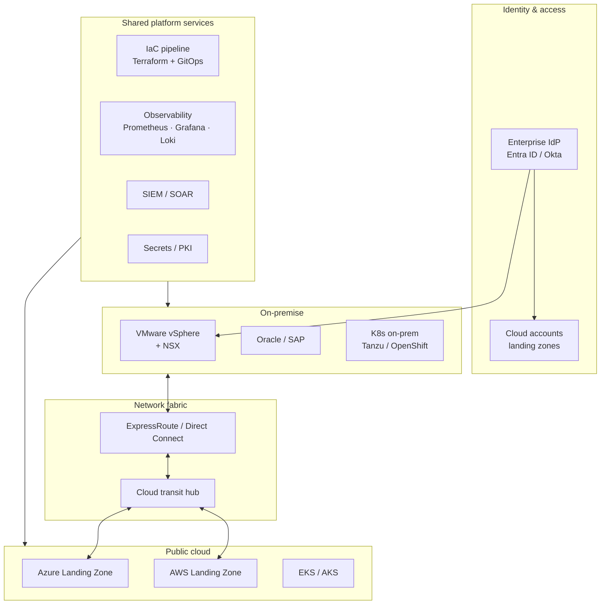

# Hybrid Cloud Modernisation — Reference Architecture

**Author:** Mohammed Abood
**Version:** 1.0
**Status:** Reference / illustrative

---

## 1. Context

Mid-to-large enterprise running a mix of legacy on-premise workloads (VMware, Oracle, SAP) and growing public-cloud footprint (AWS / Azure). Existing pain points:

- Multiple isolated monitoring tools — no single source of truth
- Inconsistent identity & access across on-prem and cloud
- Network connectivity ad-hoc (per-project VPNs/Direct Connects)
- Slow provisioning cycles, ticket-driven rather than self-service
- Audit findings around segregation, change governance, and patching

## 2. Goals

- **Resilience** — reduce blast radius of any single failure
- **Operational risk** — fewer surprises, faster recovery
- **Automation** — golden-path provisioning, no snowflakes
- **Audit readiness** — evidence-by-default
- **Visibility** — one pane of glass for ops & security

## 3. Non-goals

- Cloud-only — on-prem remains for latency, regulatory, and licensed workloads
- Lift-and-shift only — modernisation happens incrementally

## 4. Target architecture (high level)

## 5. Design decisions

### 5.1 Landing zones
- AWS Control Tower + AFT (Account Factory for Terraform)
- Azure Enterprise-scale Landing Zone (CAF-aligned)
- All accounts/subscriptions vended from a single Terraform pipeline
- Mandatory SCPs/Azure Policy: deny public S3, deny disabled encryption, deny resources in non-approved regions

### 5.2 Identity
- Single corporate IdP for human access (Entra ID / Okta)
- Federation into all clouds; **no long-lived cloud users**
- Workload identity via OIDC / IRSA / Managed Identities — **no static keys in code**

### 5.3 Connectivity
- ExpressRoute (Azure) and/or Direct Connect (AWS) terminating into a cloud transit hub
- Hub-and-spoke per cloud; spoke = workload VNet/VPC; hub = shared services + egress
- Single egress per cloud, inspected (NGFW)

### 5.4 Compute
- VMware retained for legacy and regulated workloads
- New stateless workloads on Kubernetes — on-prem (Tanzu/OpenShift) and in-cloud (EKS/AKS)
- Same Helm / GitOps stack on both — workload portability over runtime parity

### 5.5 Data
- Oracle / SAP remain on-prem until vendor-supported cloud path is GA in region
- New OLTP on managed cloud DBs (Aurora / Azure SQL)
- Data lake on cloud object storage; on-prem batch jobs egress via dedicated lane

### 5.6 Observability
- Prometheus + Grafana + Loki + Alertmanager (see [observability-platform](https://github.com/mohammedabood/observability-platform))
- Federated Prometheus between on-prem and cloud collectors
- SLOs defined per service; error-budget burn alerts vs hard thresholds
- Centralised log retention with hot/warm/cold tiers

### 5.7 Security
- Cloud-native CSPM (Defender for Cloud / Security Hub) feeding the corporate SIEM
- Common log schema (OCSF where possible)
- Patch management standardised across estate; reported as KPI
- Privileged access via just-in-time elevation (PIM / SSM Session Manager / Teleport)

## 6. Operating model

| Capability | Owner |
|---|---|
| Cloud landing zones | Cloud platform team |
| K8s platform | Platform engineering |
| Network fabric | Network ops |
| Identity | IAM team |
| Observability tooling | SRE |
| Security baselines | Security / GRC |
| Workload ownership | Product teams (you build it, you run it) |

## 7. Migration approach

A wave-based migration following a **6R** framing (Retire, Retain, Rehost, Replatform, Refactor, Repurchase). Each wave:

1. Application discovery (dependencies, data, integrations, licensing)
2. Target state decision (which R applies)
3. Landing zone readiness check
4. Migration sprint (2–6 weeks)
5. Cutover (out-of-hours window with rollback plan)
6. Stabilisation + handover to product team
7. Retrospective; feed lessons into the platform team

## 8. Risks & mitigations

| Risk | Mitigation |
|---|---|
| Cloud cost surprise | Landing zone budgets + Cost Anomaly Detection; FinOps practice |
| Skill gap in-house | Pair-on-migration with platform team; training plan |
| Data residency | Region-pinning policies; legal review per workload |
| Lock-in via cloud-managed services | Prefer OSS managed (PostgreSQL, Kafka) where SLAs allow |
| Network egress costs | Egress consolidation; cache & CDN where applicable |

## 9. What "done" looks like

- All cloud accounts / subscriptions vended from IaC pipeline; zero ClickOps
- 100% of human cloud access via IdP federation
- All workloads emit metrics + logs into the central observability stack
- Patching SLAs reported as KPI to leadership
- Audit evidence generated automatically (configuration baseline, access reviews, change logs)
