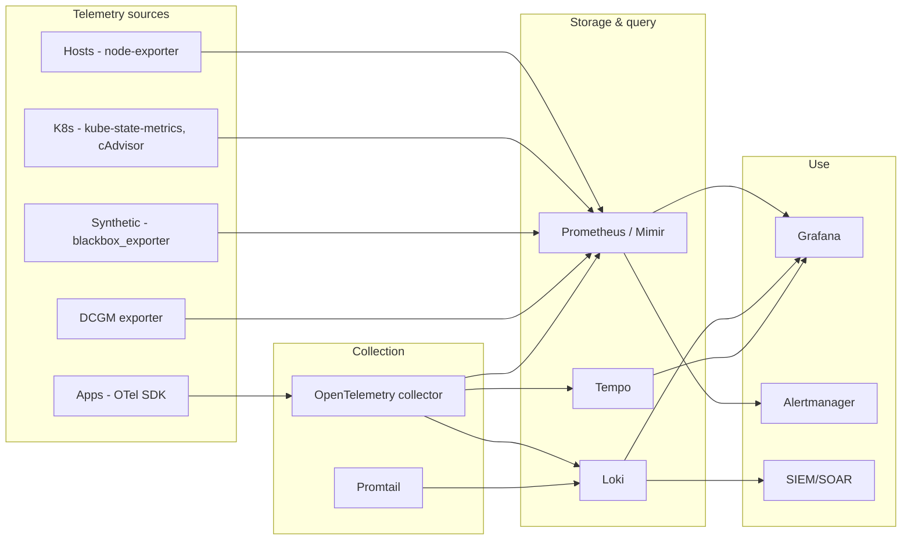

# Observability Baseline — Reference Architecture

**Author:** Mohammed Aboud
**Version:** 1.0
**Status:** Reference / illustrative

---

## 1. Context

Most infrastructure & platform teams suffer from one of two extremes: **monitoring tools that page constantly but never tell you what's wrong**, or **dashboards that look impressive but nobody trusts during incidents**. This baseline targets the middle: a stack that's signal-rich, alert-disciplined, and runbook-anchored.

## 2. Principles

1. **SLOs over thresholds.** Pages happen when error budget burns, not when CPU spikes.
2. **Every alert has a runbook.** No runbook → no alert. Period.
3. **One pane of glass.** Operators don't tab-hop between 5 tools mid-incident.
4. **High cardinality is OK, infinite cardinality is not.** Tag intentionally.
5. **Logs are evidence, not signal.** Use them to confirm; never poll-from-logs for alerting.

## 3. Architecture



## 4. Signal model

| Signal | Tool | Retention | Cardinality budget |
|---|---|---|---|
| Metrics | Prometheus / Mimir | 30d hot, 1y cold | ~1M active series per Prom |
| Logs | Loki | 30d hot, 90d cold | Label cardinality < 1000 per stream |
| Traces | Tempo | 7d hot | Sampling: 100% errors, 1% successes |

## 5. SLO framework

For every customer-facing service, define:

- **SLI** — measurable signal (e.g. successful HTTP 200/total)
- **SLO** — target (e.g. 99.9% over rolling 28d)
- **Error budget** — `1 − SLO` × time
- **Burn-rate alerts** — fast-burn (2% of budget in 1h) + slow-burn (10% in 6h)
- **Owner** — single team, named, on-call

### Example SLO definition

```yaml
service: checkout-api
sli:
  numerator: sum(rate(http_requests_total{job="checkout-api",code=~"2..|3.."}[5m]))
  denominator: sum(rate(http_requests_total{job="checkout-api"}[5m]))
objectives:
  - target: 0.999
    window: 28d
alerts:
  - name: CheckoutSLOFastBurn
    burn_rate: 14.4   # consumes 2% in 1h
    window: 1h
    severity: page
  - name: CheckoutSLOSlowBurn
    burn_rate: 6      # consumes 10% in 6h
    window: 6h
    severity: ticket
```

## 6. Alerting discipline

1. **Severity matters more than count.** Three tiers: `page`, `ticket`, `info` — and ticket-grade alerts go to a queue, not your phone.
2. **Inhibit cascades.** `HostDown` should inhibit all warnings for that host.
3. **Group meaningfully.** Group by `alertname, cluster, severity`; not every fired alert is its own page.
4. **Every alert has a runbook URL.** Linked from the alert annotation.
5. **Review alerts monthly.** Kill noisy ones. Tighten silent ones.

## 7. Dashboards

Three tiers, in order of audience:

- **Executive** — single page, SLO health for top services, monthly trend
- **Service** — per-service: SLI, latency P50/P95/P99, errors, dependencies
- **Diagnostic** — deep technical: per-pod, per-host, GPU metrics, trace explorer

Avoid the trap of "one dashboard per metric." Build dashboards around **incidents you've actually had**.

## 8. Implementation reference

See [`observability-platform`](https://github.com/m-aboud/observability-platform) for a runnable docker-compose stack that implements:

- Prometheus + Alertmanager + Grafana + Loki + Promtail + Node Exporter + cAdvisor
- 9 alert rules covering hosts and containers
- Provisioned datasources and a starter dashboard
- Runbooks for `HostDown`, `HighCPU`, `DiskSpaceLow`

## 9. Maturity model

| Level | Description |
|---|---|
| **0 — Ad-hoc** | Tools exist but inconsistently deployed; alerts ignored |
| **1 — Coverage** | All hosts and services emit metrics & logs; basic dashboards |
| **2 — Discipline** | Every alert has a runbook; alert review cadence; on-call rota |
| **3 — SLO-driven** | Pages happen only when error budget burns; tickets for slow burn |
| **4 — Self-serving** | Product teams own their SLOs; platform provides the substrate |

Most enterprises sit at 1–2 and benefit hugely from moving to 3.
