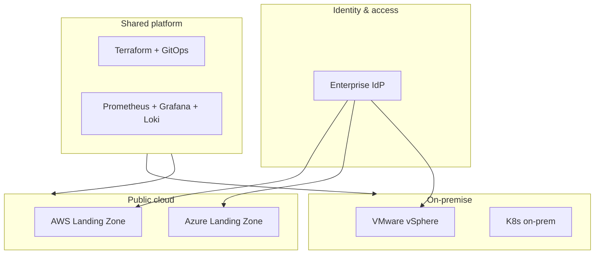
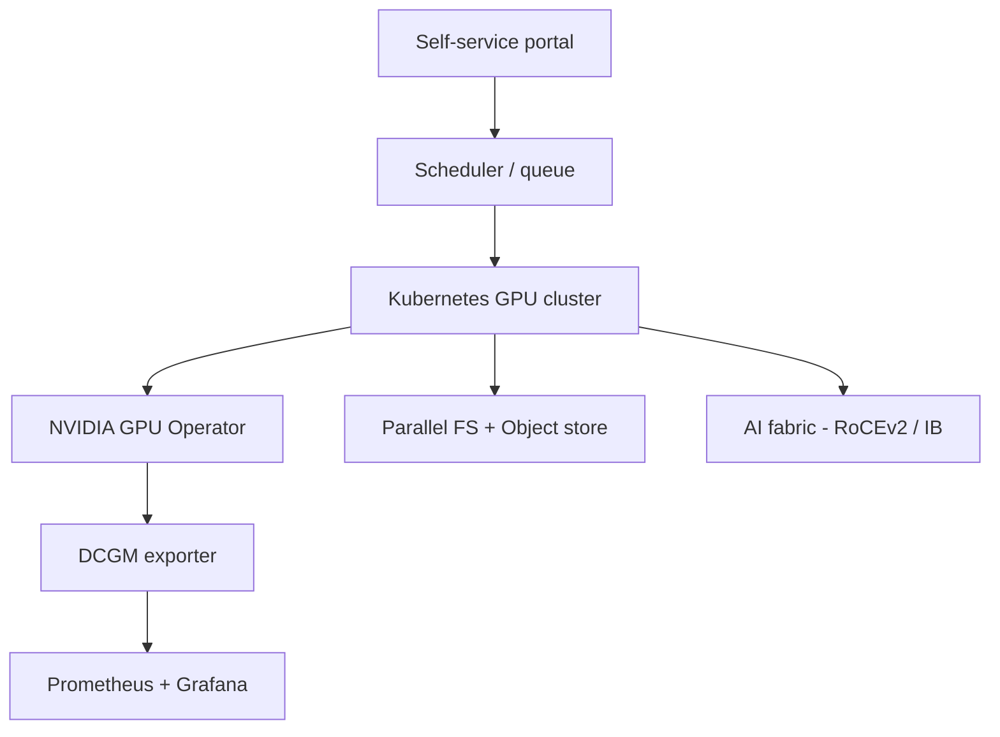
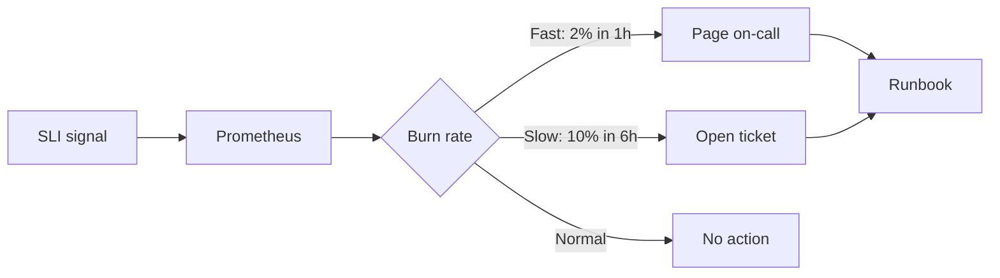
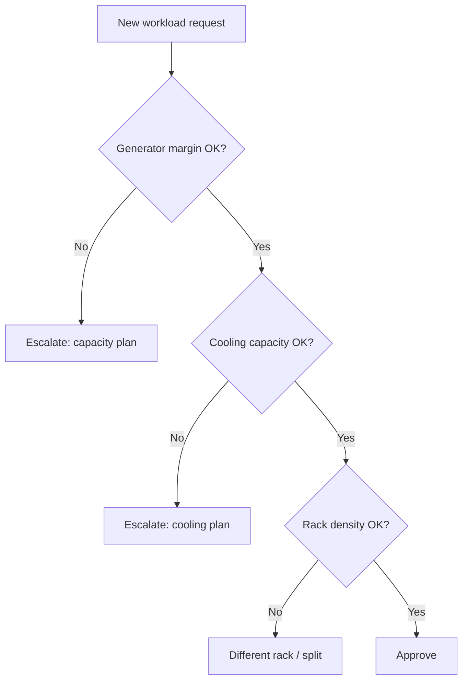

# Diagrams

Mermaid sources for diagrams used across the portfolio. Each block can be copy-pasted into Markdown that supports Mermaid (GitHub, Notion, Obsidian, etc.).

## Hybrid cloud target state

## AI platform layered view

## SLO-driven alerting flow

## DC capacity decision flow

